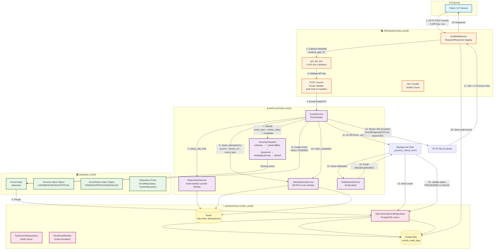
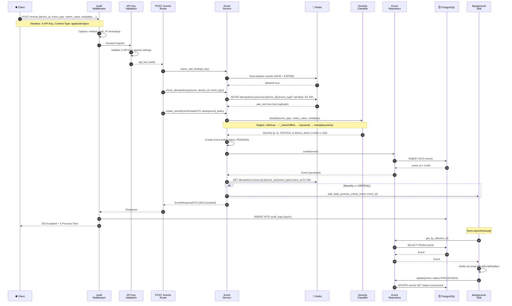
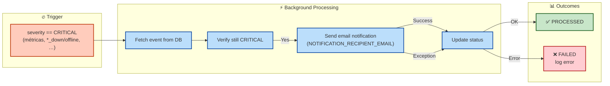
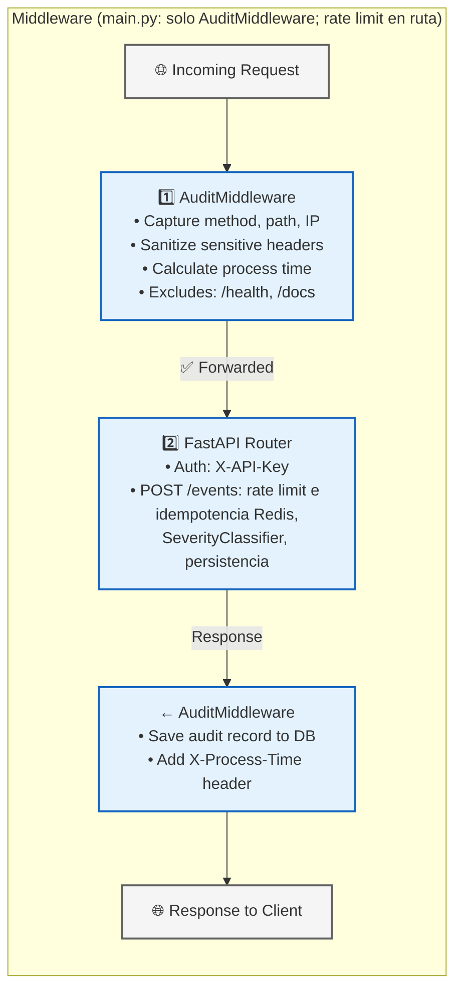
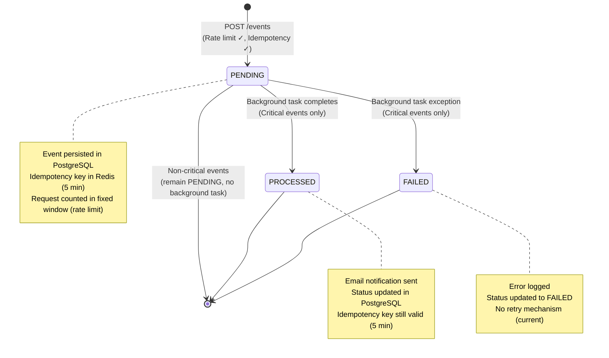
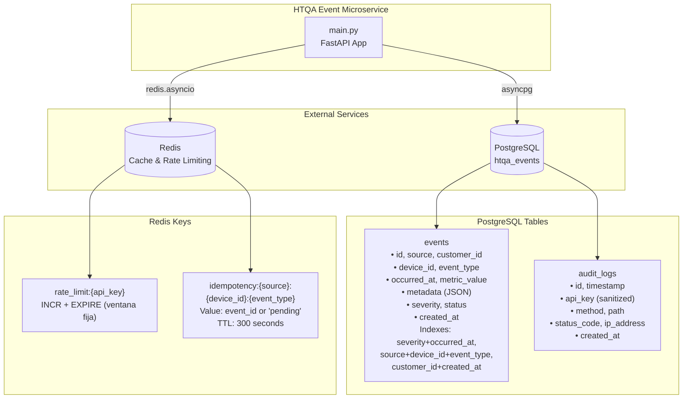

# HTQA Event Microservice - Flow Diagram

## Architecture Overview (Clean/Hexagonal)

El cliente recibe `202 Accepted` en el paso 12; las tareas 13–16 del background pueden seguir en paralelo y no bloquean la respuesta HTTP.

## Request Flow Sequence

## Critical Events Background Processing

## Middleware Chain (Outer → Inner)

## Data Flow: Event Lifecycle

## Infrastructure Dependencies

